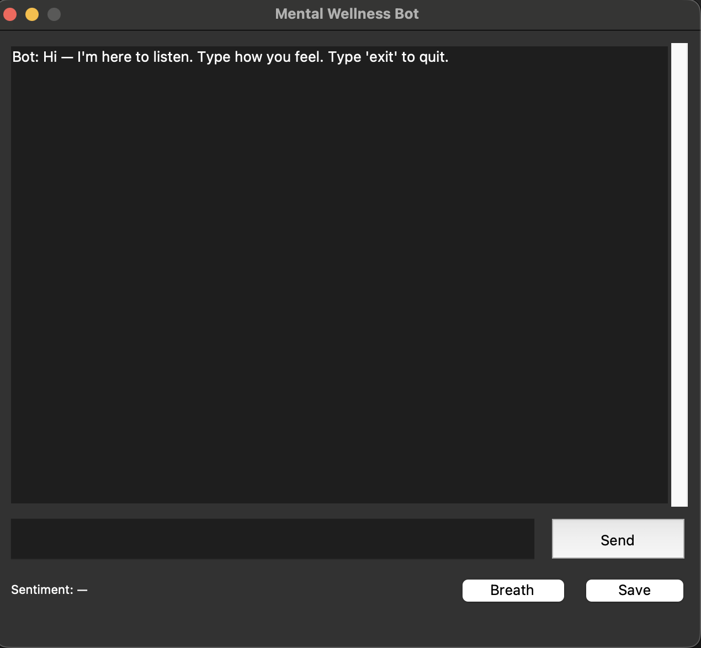
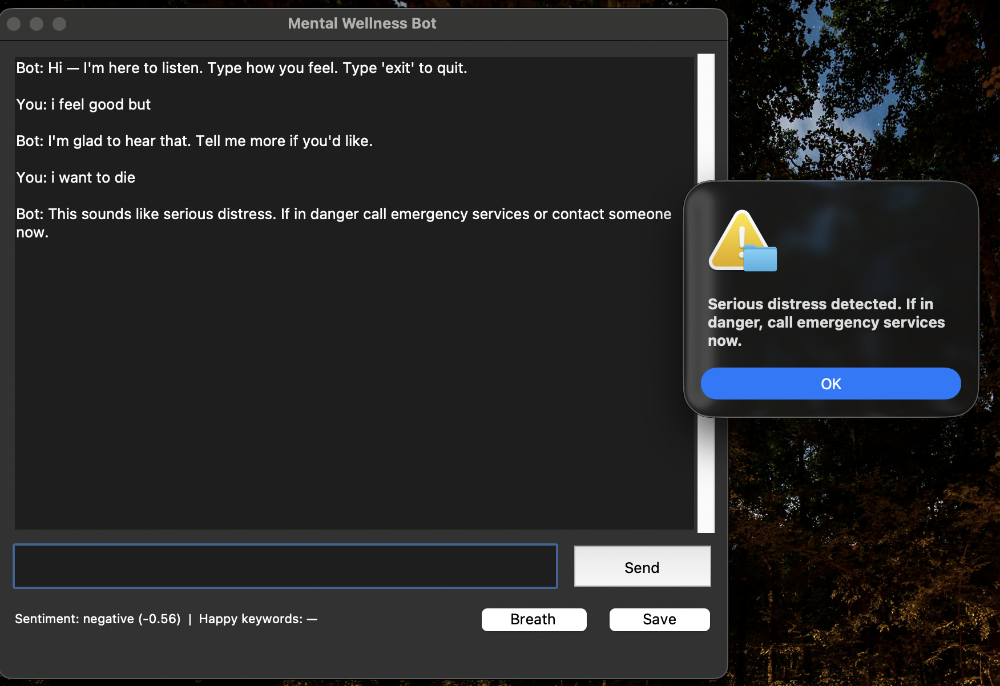

Mental Wellness Support Bot

A simple Python-based mental wellness chatbot that uses NLP, VADER Sentiment Analysis, and a Tkinter desktop UI.
It detects sentiment, responds interactively, handles greetings, remembers your name, and identifies crisis keywords.

⸻

✨ Features
	•	Tkinter desktop UI (no browser)
	•	NLP Keyword extraction
	•	VADER Sentiment Analysis
	•	Crisis detection & warning
	•	Greeting detection (hi, hello, hlo, hey)
	•	Happy keyword detection
	•	Name memory
	•	Typing simulation
	•	Quick replies
	•	Save chat as .txt

⸻

🧠 Technologies Used
	•	Python
	•	Tkinter
	•	NLTK
	•	VADER Sentiment Analyzer
	•	Regex (keyword detection)

⸻

📂 How to Run
  • pip install nltk
  • python3 mental_bot.py
  
⸻

🎯 Project Members
	•	Swayam Arora – 1/24/SET/BCS/349
	•	Ronit Sharma – 1/24/SET/BCS/348
	•	U. Abhishek – 1/24/SET/BCS/347
	•	Ria Singh – 1/24/SET/BCS/350
	•	Aayush Bhushan – 1/24/SET/BCS/352
	
⸻

📌 Future Scope
	•	Add speech-to-text
	•	Add LLM-based responses
	•	Add professional support API

⸻
 📷 Screenshots

 App Start

 Crisis Detection

