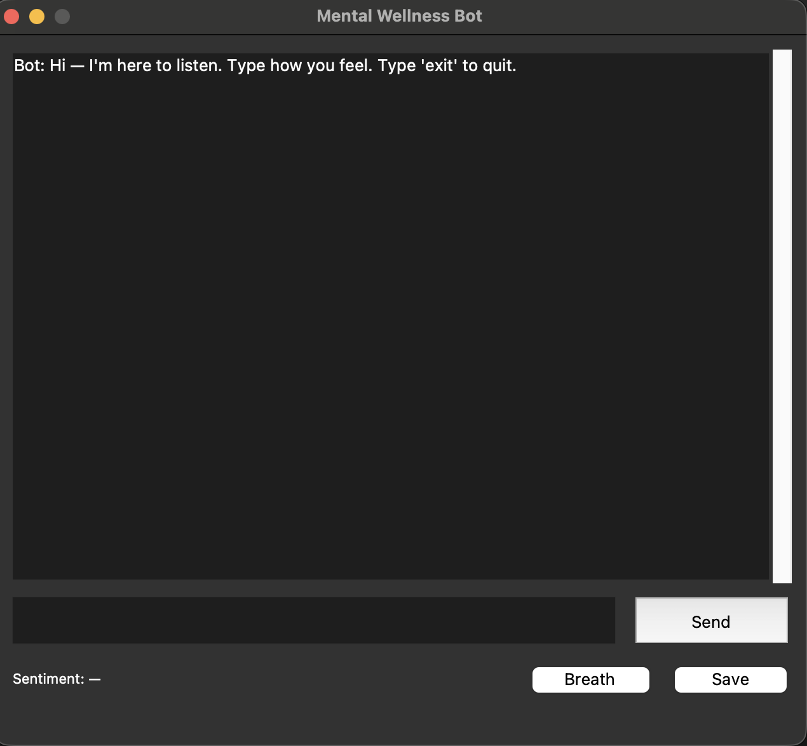
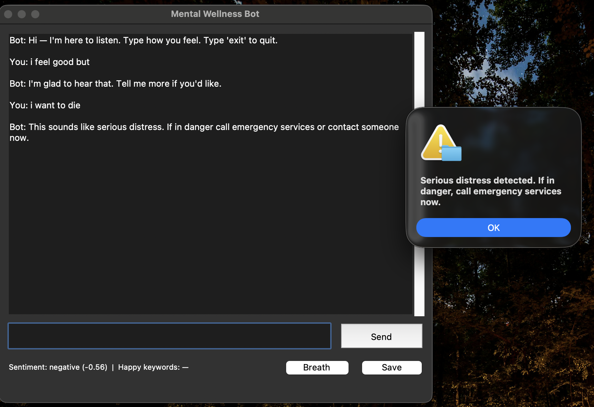

# 🧠 Mental Wellness Support Bot

A simple **Python-based Mental Wellness Chatbot** designed to provide basic emotional support through interactive conversations.
The bot uses **Natural Language Processing (NLP)**, **VADER Sentiment Analysis**, and a **Tkinter Desktop UI** to detect emotions, respond intelligently, and identify crisis-related messages.

---

## ✨ Features

* 💻 Tkinter Desktop GUI (No browser required)
* 😊 Sentiment Analysis using VADER
* 🧾 NLP Keyword Extraction
* ⚠️ Crisis Detection & Warning Alerts
* 👋 Greeting Detection (`hi`, `hello`, `hlo`, `hey`)
* 😄 Happy Mood Detection
* 🧠 Remembers User Name
* ⌨️ Typing Simulation for Natural Feel
* ⚡ Quick Reply Buttons
* 💾 Save Chat History as `.txt`

---

## 🧠 Technologies Used

* Python
* Tkinter
* NLTK
* VADER Sentiment Analyzer
* Regex (Keyword Detection)

---

## 📂 Installation & Run

### Step 1: Install Required Library

```bash
pip install nltk
```

### Step 2: Run the Project

```bash
python3 mental_bot.py
```

---

## 📸 Screenshots

### 🏠 App Start



### ⚠️ Crisis Detection



---

## 🎯 Project Members

* Swayam Arora – 1/24/SET/BCS/349
* Ronit Sharma – 1/24/SET/BCS/348
* U. Abhishek – 1/24/SET/BCS/347
* Ria Singh – 1/24/SET/BCS/350
* Aayush Bhushan – 1/24/SET/BCS/352

---

## 📌 Future Scope

* 🎤 Add Speech-to-Text Support
* 🤖 Add LLM-Based Smart Responses
* 📞 Add Professional Mental Health Support API
* 🌍 Add Multi-language Support
* 📊 Mood Tracking Dashboard

---

## 🤝 Contribution

Contributions, suggestions, and improvements are welcome.
Feel free to fork this repository and create a pull request.

---

## 📜 License

This project is for educational purposes.

---

## 💙 Note

This chatbot provides **basic emotional support only** and is **not a replacement for professional mental health care**. .
